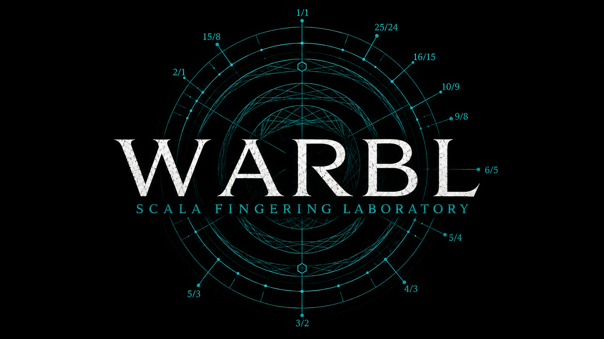

# WARBL Scala Fingering Laboratory — Quick Start

**Version:** v1.1  
**Primary application:** `WARBL_Scala_Fingering_Lab_v1_1.html`  
**Purpose:** choose a Scala tuning, generate an understandable WARBL mapping, hear exact pitch, connect the controller, play, and export the result without first learning the entire Deep Laboratory.

## 1. Open the Lab

1. Unzip the release folder somewhere you can keep it.
2. Double-click `WARBL_Scala_Fingering_Lab_v1_1.html`.
3. Open it as a **top-level page** in a current Chromium-based desktop browser with Web MIDI available.
4. When you want hardware input, press **Connect WARBL / MIDI** and allow the browser's MIDI permission request.

The Laboratory is a self-contained HTML application; it does not require a server or installer. The embedded WARBL SFL artwork is used as the browser favicon. Your operating system may still show the icon of the browser associated with `.html` files in its file manager; that behavior belongs to the OS, not to the Lab.

## v1.1 performance update

v1.1 repairs the sustained-legato degree-ownership edge case documented in v1.0. Tiny finger motion may still shade the established center, but a real raw-topology change cannot remain indefinitely attached to the previous carrier: coherent evidence may accelerate arrival and the internal reference voice has a conservative 24→32 ms Web Audio-clock arrival. Listening Space now spans 0–100%.

## 2. Start in Discover

The opening gateway offers two depths:

- **Discover — Choose · hear · map · play**
- **Deep Laboratory — All authoring and diagnostics**

For a first session, stay in **Discover**. It uses the same project and the same tuning engine as Deep Laboratory; it simply hides advanced controls.

The Discover path is:

1. Choose a scale.
2. Hear its shape.
3. Review a **Recommended Playable Field** and apply one if useful.
4. Connect and play.
5. Export or go deeper.

### Do I need a new fingering for every Scala file?

**No.** You can keep one familiar WARBL fingering system for every tuning if that is the most playable choice for you. The Laboratory exists so you can compare that familiar arrangement with two alternatives:

- **Familiar mapping** — preserve maximum muscle memory.
- **Scale-specific mapping** — arrange fingerings around the particular tuning.
- **Hybrid mapping** — keep most familiar fingerings and change only the ones that benefit from another placement.

The Scala file does not have to change. The Laboratory changes the relationship between physical fingering and scale degree. For many performers, the familiar mapping may remain the best answer.

## 3. Choose or import a Scala tuning

The Lab opens with `ptolemy.scl` as a demonstration. To use your own tuning, go to **Import** and choose a `.scl` file or readable Scala text.

The source Scala expression remains the canonical source. Mapping, playable fields, notation, and exports are derived from it rather than silently rewriting it.

For larger collections, **Scale Discovery** can index the Huygens–Fokker Scala archive locally in the browser. Nothing is uploaded by that indexing process.

## 4. Choose the center and generate a proposal

Under **Choose the center**:

- select the **Performance center** and **Center MIDI note**;
- set the **A4 reference (Hz)** if needed;
- choose a **Fingering starting point**;
- choose the **Mapping priority**;
- choose the intended **Bend range** and destination.

**Neutral Sequential Opening** is the recommended starting point. Familiar instrument fingerings are available, but may trade coverage or ergonomic completeness for continuity with an existing fingering system.

Press **Generate proposal**. The Laboratory proposes; the performer decides. You can later edit and lock individual mappings in **Mapping Studio**.

## 5. Hear exact pitch before routing anything else

Under **Play and route**, leave **Playback route** on **Laboratory Reference Instrument** for the first test. The nearby **Performance controls** set the internal reference level and reference-instrument choice without rewriting outgoing MIDI expression.

The default performer reference is **Harmonic Reed — Performer Reference**. The internal path plays exact frequencies and does not require a VST, MTS, pitch-bend calibration, or a DAW.

Use **Test Reference Instrument — A4** if you need to confirm that browser audio is awake.

The v1.1 internal WARBL2 performance path preserves the accepted Harmonic Reed low-breath response, G3.2 finger commitment, and rapid-alternation assistance.

## 6. Connect WARBL2 — Live WARBL monitor

Under **Play and route**:

1. Choose **WARBL MIDI 1** (or the appropriate WARBL input) under **MIDI input**.
2. When configuration reads/writes are needed, choose the WARBL port under **WARBL configuration output**.
3. If the connection is unclear, open **WARBL / MIDI diagnostics** and use **Connect & run diagnostic**.

The diagnostic follows the connection chain in order: browser context, Web MIDI API, permission, port scan, selected WARBL input, configuration output, incoming traffic, and WARBL state response.

## 7. Play

The important v1.1 rule is simple:

**A decisive fingering chooses the Scala destination; continuous physical expression shapes the path to it.**

G3.2 finger commitment keeps physical fingering, mapped candidate, and sounding ownership distinct during a transition. When a note is sounding, the primary visual identity follows the sounding degree until musical ownership transfers; physical and mapped candidates remain visible as witnesses.

For rapid repeated A↔B motion, the Lab can recognize a recurrent physical edge and use **rapid-alternation / trill assistance** so a trill can reach exact mapped centers instead of repeatedly being trapped in unfinished geometric debt.

## 8. Use Recommended Playable Field for larger tunings

Open **Recommended Playable Field** when the full source scale is larger than one comfortable physical reading.

A playable field is a performance view of the source—not a replacement for the source. The complete Scala tuning remains canonical. You can inspect the recommendation, mark degrees required/excluded, then choose **Use selected field** or return to **Use full source attempt**.

## 9. DAW / virtual MIDI — External synth or DAW

When the internal reference path is correct:

1. Select a **Retuned MIDI destination**.
2. Choose **Full MPE lower zone · recommended** or **Monophonic pitch bend · compatibility**.
3. Change **Playback route** to **External Synth / DAW**.
4. Download the current `.scl` and matching `.kbm` where the receiver supports them.
5. Match the receiving instrument's MPE zone and pitch-bend range to the Laboratory.
6. Test one held note and one overlapping legato note before performing.

The exports carry tuning and mapping context. They do **not** automatically change a VST preset, DAW route, MPE zone, or synth bend range. External receiver compatibility remains destination-specific.

## 10. If something goes wrong, record evidence

Open **Performance Event Trace** and use **Start Flight Recorder** before reproducing the problem. Stop and export afterward.

A Flight Recorder file is diagnostic evidence. Attach it to a GitHub issue when reporting a bug or unexpected controller behavior.

The Lab keeps raw controller observations separate from its musical interpretation. This matters especially for pitch bend, pressure, and IMU data, which may already have roles in the user's WARBL profile.

## 11. Advanced Performance Tuning Navigation

This feature is intentionally hidden in **Deep Laboratory** and is **OFF by default**.

When explicitly enabled, **Advanced Performance Tuning Navigation** can advance through the bundled tuning bank from:

- one learned yaw excursion, or
- a safely learned WARBL Button 1 or Button 2 message.

Important yaw rule: **navigation observes yaw; it does not own yaw**. The learned yaw message is not consumed, remapped, or suppressed. If yaw already controls timbre, space, expression, or another destination in the active controller profile, that expressive use continues unchanged.

Because a normal expressive yaw gesture can still cross the navigation excursion, set the excursion outside the performer's ordinary expressive range. One excursion advances once; return to center to re-arm.

A tuning request made while a note is sounding is queued and commits only at the final release boundary. Button 3 remains guarded because WARBL uses it for critical/power gestures.

This advanced navigation layer is software/runtime-gated and opt-in; it should be physically verified with the performer's actual profile before stage use.

## 12. Save your work

Use **Export and install** for durable files rather than relying only on browser storage.

Useful outputs include:

- **Project Export Snapshot ZIP** — SCL, JSON, CSV, 256-state table, and synth guidance;
- **Profile JSON** — provenance and logic;
- **Mapping CSV** — degree-by-degree mapping;
- **WARBL notes / 256 MIDI values** — for Configuration Tool workflows;
- **Print / Save PDF** — human-readable report.

**Direct WARBL2 installation** writes only the validated 256-value chart after explicit confirmation. It does not change breath, legato, register, pressure, buttons, channel, or bend range. Complete 256-value readback from an existing custom slot is not claimed.

## Support and updates

Use **Report bug / request feature** or **Open a GitHub issue** inside the Lab. The issue link pre-fills the Lab version, active tuning, and browser/OS information.

Update checks are manual through **Check GitHub for update**. The Lab never silently replaces itself.

---

**Release boundary:** v1.1's core internal WARBL2 performance behavior is supported by the recorded multi-tuning physical trace and the promotion simulation gate. Advanced yaw/button tuning navigation remains opt-in and separately scoped for physical profile testing; external synth/DAW behavior remains receiver-dependent.

## WARBL2 reference preset

An optional reference controller preset is included at `../profiles/WARBL2/WARBL_SFL_reference_preset.warbl`. Save your own WARBL configuration before importing it. The Lab never loads this file automatically.
